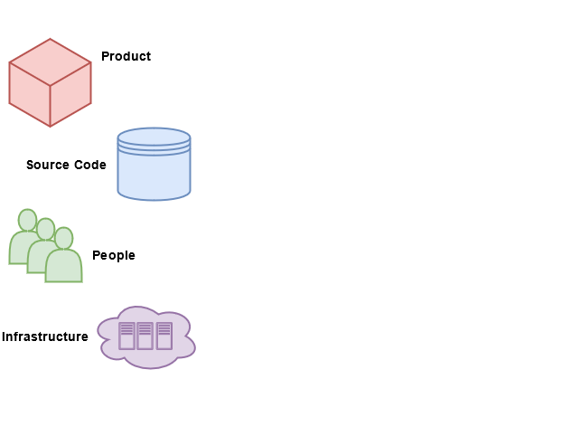
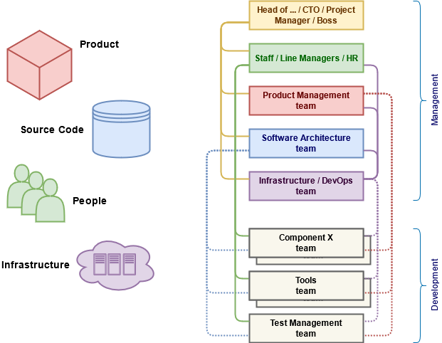

<!-- _class: lead white-page -->

Project organization
====================

Multidimensional Software Project management structure

       

Alexander Krapivin

2020.06.03

---
<!-- _class: white-page -->

Project organization: the main entities
=======================================

* **Product**
   What do we produce?
   What do we sale?
* **Source code**
   What is our property?
   What do we own?
* **People**
   Who does all things?
* **Infrastructure**
   What do we need?

---
<!-- _class: white-page -->

Project organization: management structures
===========================================

* The Head of ...
* **People:**
  Staff / Line Management / HR
* **Product:**
  Product Management team
* **Source code:**
  Software Architecture team
* **Infrastructure:**
  Infrastructure / DevOps / DevSecOps

---
<!-- _class: white-page -->

Required efforts
================

Development                  | MM
-----------------------------|---
Bla bla bla                  | 4​
Implement                    | 2​
Bla bla bla                  | 1​
Test                         | 6​
Bla bla bla                  | 8​
**TOTAL:**                   | 21

Maintenance                  | MM
-----------------------------|---
Bla bla bla                  | 4​
Support                      | 1​2
Bla bla bla                  | 6+
**TOTAL:**                   | 22

---

     

Have a nice day!
================
